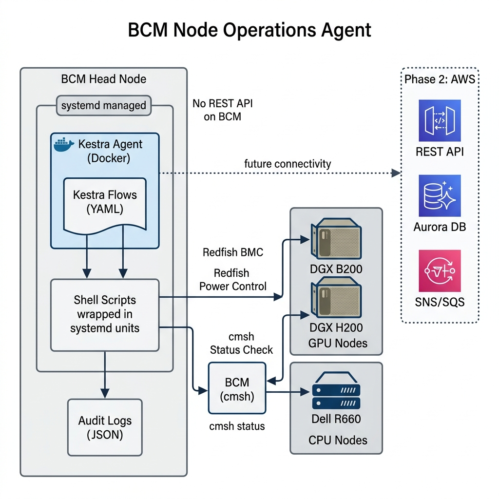

# BCM Node Operations Agent

Kestra-based node lifecycle agent for BCM-managed GPU/CPU fleets. Runs on the **BCM head node** using **containerd** (managed by systemd). No REST API — operations are executed via Kestra flows that invoke systemd-wrapped shell scripts.



---

## What It Does

| Operation | Method | Script |
|-----------|--------|--------|
| **Reboot** (graceful / force) | Redfish `ComputerSystem.Reset` | `scripts/redfish-reboot.sh` |
| **Power On** | Redfish `ResetType: On` | `scripts/redfish-power-on.sh` |
| **Power Off** (graceful / force) | Redfish `GracefulShutdown` / `ForceOff` | `scripts/redfish-power-off.sh` |
| **Power Cycle** | Redfish `ResetType: PowerCycle` | `scripts/redfish-power-cycle.sh` |
| **Status Check** | BCM `cmsh` | `scripts/node-status.sh` |

Supports both **GPU nodes** (DGX B200, H200) and **CPU nodes** (Dell R660).

### Redfish ResetType Mapping

| Action | Mode | Redfish ResetType |
|--------|------|-------------------|
| Reboot | graceful | GracefulRestart |
| Reboot | force | ForceRestart |
| Power On | — | On |
| Power Off | graceful | GracefulShutdown |
| Power Off | force | ForceOff |
| Power Cycle | — | PowerCycle |

---

## Repo Layout

```
bcm-node-ops-agent/
├── scripts/
│   ├── common.sh                 # Shared: logging, inventory lookup, Redfish helper
│   ├── setup.sh                  # One-time install (pull images, deploy files)
│   ├── node-status.sh            # cmsh status check
│   ├── redfish-reboot.sh         # Redfish reboot (graceful/force)
│   ├── redfish-power-on.sh       # Redfish power on
│   ├── redfish-power-off.sh      # Redfish power off (graceful/force)
│   └── redfish-power-cycle.sh    # Redfish power cycle
│
├── kestra/
│   ├── application.yaml          # Kestra standalone config
│   └── flows/                    # Kestra flow definitions (YAML)
│       ├── node-reboot.yaml
│       ├── node-power-on.yaml
│       ├── node-power-off.yaml
│       ├── node-power-cycle.yaml
│       ├── node-status.yaml
│       └── fleet-health-report.yaml
│
├── systemd/
│   ├── bcm-node-ops-db.service       # PostgreSQL via containerd/ctr
│   ├── bcm-node-ops-kestra.service   # Kestra Agent via containerd/ctr
│   ├── node-status@.service          # Templated cmsh status
│   ├── node-reboot@.service          # Templated Redfish reboot
│   ├── node-power-on@.service        # Templated Redfish power-on
│   ├── node-power-off@.service       # Templated Redfish power-off
│   └── node-power-cycle@.service     # Templated Redfish power-cycle
│
├── config/
│   └── nodes.yaml                # Node inventory (BMC IPs, allowed actions)
│
├── .env.example                  # Credential template
├── tests/
│   └── test-scripts.sh           # 13 shell tests (inventory, allowlist, audit)
└── docs/
    └── images/architecture.png
```

---

## Quick Start: BCM Head Node

### Prerequisites

- **containerd** running (`systemctl status containerd`)
- **ctr** CLI available (ships with containerd)
- **crictl** available (for container inspection)
- Network access to BMC VLAN 300 (Redfish)
- `cmsh` available (BCM head node)

### Step 1 — Clone

```bash
git clone https://github.com/SrikantaDatta51/bcm-node-ops-agent.git
cd bcm-node-ops-agent
```

### Step 2 — Edit Node Inventory

Edit `config/nodes.yaml` with your actual nodes and BMC IPs:

```yaml
nodes:
  dgx-b200-017:
    type: gpu
    bcm_name: dgx-b200-017
    bmc_host: https://10.10.20.17       # ← your BMC IP
    allowed_actions: [status, reboot, power_on, power_off, power_cycle]

  cpu-r660-004:
    type: cpu
    bcm_name: cpu-r660-004
    bmc_host: https://10.10.30.4        # ← your BMC IP
    allowed_actions: [status, reboot, power_on, power_off, power_cycle]
```

### Step 3 — Set Credentials

```bash
cp .env.example .env
vim .env
```

```env
REDFISH_USER=admin
REDFISH_PASSWORD=your-actual-bmc-password
REDFISH_TLS_VERIFY=false
```

### Step 4 — Install

```bash
sudo bash scripts/setup.sh
```

This will:
1. Pull Kestra + PostgreSQL images via `ctr image pull`
2. Copy scripts/config to `/opt/bcm-node-ops/`
3. Install systemd units
4. Enable services

### Step 5 — Start the Agent

```bash
# Start PostgreSQL (Kestra internal state)
sudo systemctl start bcm-node-ops-db

# Start Kestra Agent
sudo systemctl start bcm-node-ops-kestra
```

Verify containers are running:

```bash
# Via ctr
sudo ctr task ls

# Via crictl
sudo crictl ps

# Check logs
sudo journalctl -u bcm-node-ops-kestra -f
```

Kestra UI: **http://\<bcm-head-ip\>:8080**

### Step 6 — Test: Run Scripts Directly (No Kestra Needed)

```bash
source /opt/bcm-node-ops/.env
export NODE_INVENTORY_PATH=/opt/bcm-node-ops/config/nodes.yaml
export AUDIT_LOG_DIR=/var/log/bcm-node-ops

# Check node status via cmsh
/opt/bcm-node-ops/scripts/node-status.sh dgx-b200-017

# Reboot via Redfish (graceful)
/opt/bcm-node-ops/scripts/redfish-reboot.sh dgx-b200-017 graceful "manual test"

# Power off (graceful)
/opt/bcm-node-ops/scripts/redfish-power-off.sh dgx-b200-017 graceful "maintenance"

# Power on
/opt/bcm-node-ops/scripts/redfish-power-on.sh dgx-b200-017 "post-maintenance"

# Power cycle
/opt/bcm-node-ops/scripts/redfish-power-cycle.sh dgx-b200-017 "node hung"

# Force reboot (no OS shutdown)
/opt/bcm-node-ops/scripts/redfish-reboot.sh dgx-b200-017 force "node unresponsive"
```

### Step 7 — Test: Run Flows via Kestra CLI

```bash
# Dry-run reboot (safe — no Redfish call)
sudo ctr task exec --exec-id kctl bcm-node-ops-kestra \
  /app/kestra flow execute \
    --namespace bcm.node-ops \
    --id node-reboot \
    --input node_name=dgx-b200-017 \
    --input mode=graceful \
    --input reason="test from CLI" \
    --input dry_run=true

# Status check
sudo ctr task exec --exec-id kctl bcm-node-ops-kestra \
  /app/kestra flow execute \
    --namespace bcm.node-ops \
    --id node-status \
    --input node_name=dgx-b200-017

# Fleet health report (all nodes)
sudo ctr task exec --exec-id kctl bcm-node-ops-kestra \
  /app/kestra flow execute \
    --namespace bcm.node-ops \
    --id fleet-health-report
```

### Step 8 — Test: Via systemd Wrappers

```bash
# Status check via systemd
sudo systemctl start node-status@dgx-b200-017.service
journalctl -u node-status@dgx-b200-017.service --no-pager

# Reboot via systemd
sudo systemctl start node-reboot@dgx-b200-017.service
journalctl -u node-reboot@dgx-b200-017.service --no-pager
```

### Step 9 — Inspect with crictl

```bash
# List running containers
sudo crictl ps

# Container logs
sudo crictl logs <container-id>

# Container inspect
sudo crictl inspect <container-id>
```

### Step 10 — Check Audit Logs

```bash
# All entries
cat /var/log/bcm-node-ops/audit.jsonl | python3 -m json.tool --json-lines

# By node
grep dgx-b200-017 /var/log/bcm-node-ops/audit.jsonl

# Failures only
grep FAILED /var/log/bcm-node-ops/audit.jsonl
```

### Step 11 — Run Tests

```bash
bash tests/test-scripts.sh
```

```
=== BCM Node Ops Agent — Script Tests ===

--- common.sh ---
  ✓ validate_node_name accepts dgx-b200-017
  ✓ validate_node_name accepts cpu-r660-004
  ✓ validate_node_name rejects injection
  ✓ validate_node_name rejects command substitution

--- inventory lookup ---
  ✓ lookup_bmc_host finds dgx-b200-017 → https://10.10.20.17
  ✓ lookup_bmc_host finds cpu-r660-004 → https://10.10.30.4
  ✓ lookup_bmc_host rejects unknown node
  ✓ lookup_node_type dgx-b200-017 → gpu
  ✓ lookup_node_type cpu-r660-004 → cpu

--- action allowlist ---
  ✓ reboot allowed for dgx-b200-017
  ✓ power_off rejected for cpu-r660-005 (only status+reboot)
  ✓ status allowed for cpu-r660-005

--- audit log ---
  ✓ emit_audit writes structured JSON to audit.jsonl

=== Results: 13 passed, 0 failed ===
```

---

## Troubleshooting

| Issue | Fix |
|-------|-----|
| `cmsh not found` | Expected on non-BCM host — scripts return mock status |
| `Redfish timeout` | Check BMC: `curl -k https://<bmc-ip>/redfish/v1/Systems/1` |
| `REDFISH_PASSWORD must be set` | Edit `/opt/bcm-node-ops/.env` |
| `Node not found in inventory` | Add to `/opt/bcm-node-ops/config/nodes.yaml` |
| `Action not allowed` | Check `allowed_actions` in `nodes.yaml` |
| Container not starting | `sudo journalctl -u bcm-node-ops-kestra -f` |
| Pull fails | `sudo ctr image pull docker.io/kestra/kestra:latest` |
| crictl shows nothing | crictl uses CRI socket — try `sudo ctr task ls` instead |

---

## Container Management (containerd)

```bash
# ── ctr (containerd native CLI) ─────────────────────────

# List images
sudo ctr image ls

# Pull image
sudo ctr image pull docker.io/kestra/kestra:latest

# List running containers
sudo ctr task ls

# View container logs (via journald since systemd manages them)
sudo journalctl -u bcm-node-ops-kestra --no-pager -n 50

# Stop
sudo systemctl stop bcm-node-ops-kestra
sudo systemctl stop bcm-node-ops-db

# Start
sudo systemctl start bcm-node-ops-db
sudo systemctl start bcm-node-ops-kestra

# Restart
sudo systemctl restart bcm-node-ops-kestra

# ── crictl (CRI inspection) ─────────────────────────────

# List pods
sudo crictl pods

# List containers
sudo crictl ps -a

# Container logs
sudo crictl logs <container-id>

# Inspect
sudo crictl inspect <container-id>
```

---

## Phase 2: AWS Integration (Future)

Once network connectivity between BCM head node and AWS is established:

1. Switch Kestra from **standalone** to **worker** mode
2. Worker connects to **Kestra Server** running on AWS
3. Kestra Server receives events from **SNS/SQS**
4. Kestra Server dispatches flows to the **worker on BCM**
5. Results flow back through Kestra Server → **Aurora DB** → **REST API**

Change in systemd unit:
```diff
- /bin/sh -c "kestra server standalone"
+ /bin/sh -c "kestra server worker --server-url https://kestra.your-aws-domain.com"
```

---

## Security

| Layer | Control |
|-------|---------|
| Node validation | Allowlisted in `config/nodes.yaml` — no user-supplied BMC hosts |
| Action validation | Per-node `allowed_actions` list |
| Input sanitization | Regex `^[a-zA-Z0-9._-]+$` — rejects `; rm -rf`, `$(cmd)`, backticks |
| Shell execution | Only allowlisted scripts via systemd units |
| Credentials | `.env` file (gitignored), never logged |
| systemd hardening | `NoNewPrivileges`, `PrivateTmp`, `ProtectSystem=strict` |
| Audit trail | Every operation → `/var/log/bcm-node-ops/audit.jsonl` |
